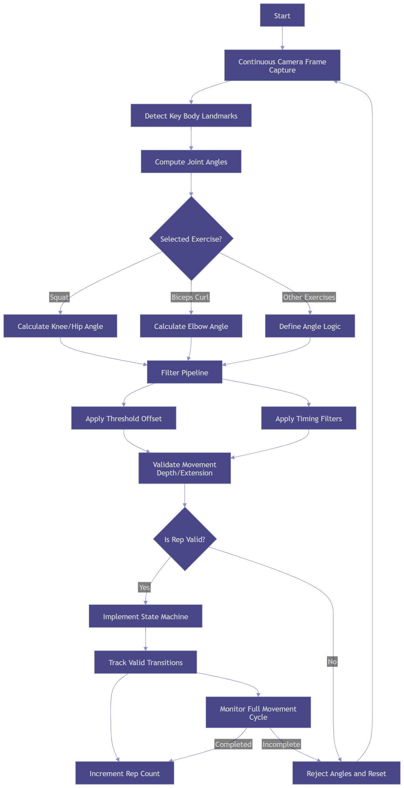

# 🏋️‍♂️ Sport Exercise Tracker Widget

A **Flutter package** that provides a ready-to-use **camera-based exercise tracker widget**.  
It allows developers to integrate **real-time exercise tracking** using the camera 🎥 and provides **automatic repetition counting** with visual feedback 📊.  

Perfect for **fitness apps**, **personal trainer apps**, or any app that wants to guide users through exercises safely and interactively.

---

## ✨ Features

- 🎥 **Real-time camera preview** (front/back)  
- 🤖 **Pose detection** using keypoints (shoulders, elbows, knees, hips…)  
- 🔄 **Automatic repetition counting** using state machine architecture for mouvement sequence detection. 
- 🎚️ Configurable **difficulty levels** (`easy`, `medium`, `hard`) and exercise types (`squat`, `biceps curl`, `leg raise`, `lateral raise`) 
- 👀 Visual feedback: keypoints, connecting lines, angles, repetition counter  
- 🎨 Adjustable **UI styles** (colors, line thickness, circle radius, angles text)  
- 🚫 Works offline — no external servers required  

---

## 🧠 How It Works (Algorithm & Logic)

The widget uses **pose keypoints & angle calculations** to detect exercises accurately. Main workflow:

1. **Pose Detection** 🤳  
   - Captures camera frames in real-time.  
   - Detects keypoints for joints (shoulders, elbows, knees, hips, etc.).  

2. **Angle Calculation** 📐  
   - Calculates **specific joint angles** per exercise.  
   - Examples:  
     - Curl → elbow angle  
     - Squat → knee & hip angles  
   - Angles determine **start & end positions** of each repetition.

3. **Difficulty Level Adjustment** 🎯  
   - Each level applies a **threshold angle offset**.  
   - Higher difficulty → stricter angle requirement to count a repetition.

4. **Timing Filter ⏱️**  
   - Ensures natural movement duration.  
   - Prevents false positives from **fast, jerky, or random movements**.  

5. **Repetition Counting 🔢**  
   - Counts a rep when:  
     1. Angle reaches **start threshold (minRequiredAngle - Difficulty_Offset)** 
     2. Then reaches **end threshold (minRequiredAngle + Difficulty_Offset)**  
     3. And **timing constraints** are satisfied
   - Sends real-time callback via `onRepsRepetitionCount`.

6. **Visual Feedback 👁️**  
   - Draws **keypoints** on camera feed  
   - Connects joints with **lines** for better guidance  
   - Optional **angle labels** for user reference  
   - Repetition counter shown on screen  

---

## 🚀 Usage Example

```dart
import 'package:sport_exercise_tracker_widget/camera_sport_exercise_tracker_widget.dart';

CameraSportExerciseTrackerWidget(
  cameraConfig: CameraConfig(cameraDirection: CameraLensDirection.front),
  exerciseName: ExerciseName.curl,
  enableExerciseRepsCounting: true,
  resetExerciseRepsCounting: false,
  difficultyLevel: ExerciseDifficultyLevel.medium,
  showKeypointCircles: true,
  showKeypointLines: true,
  showAnglesText: true,
  onRepsRepetitionCount: (reps) {
    print("Reps counted: $reps");
  },
);
```

🧩 Exercise Tracker Functional Diagram:


## 🎬 Check the video demo here [Video Demo](https://www.youtube.com/shorts/qgLKCHRKjE8)

## 🔧 What’s Next / To Be Improved

### 1. Separation of Concerns
Currently, `ExercisePosePainterWidget` calculates angles and counts repetitions.  

**Planned improvement:** move the calculation logic to a parent widget and **inject only the calculated angles and rep counts** into the painter. This will make the widget cleaner and easier to maintain.

### 2. Add More Exercises
Currently, 4 exercises are implemented. You can easily add more exercises based on your needs.  

**To add an exercise:**  
1. Add the exercise in `models/exercises.dart`  
2. In `enums.dart`, define its `minRequiredAngle` and `offsetAngles`  
And That’s it 😀, the new exercise will be available in the dropdown selector in the example code.